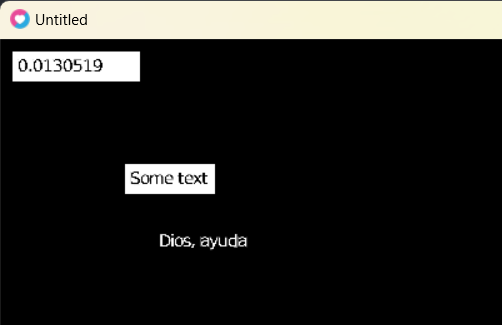

# Love and Lua

I love the simplicity of Lua, so on my free time I code some stuff and trying
to create my own GUI framework and some utilities. Learn some data structures
and OOP concepts with low level function lua capacities.

Just for fun.

So far I got this :)

